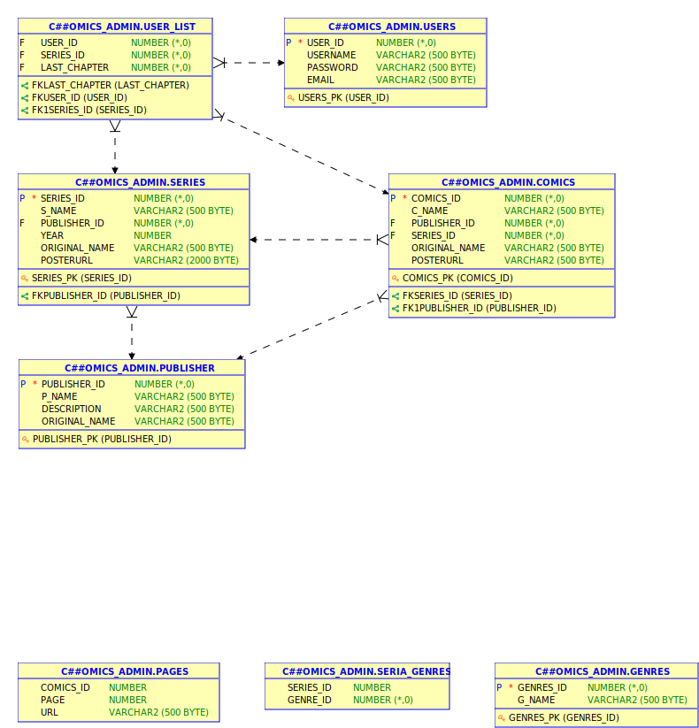

## Project name - Read Comics

### Project goal and it's benefits: 
Our project was created for comic lovers. On this site you can read different comics for 
your taste. We created all the conditions so that the user was not bored and comfortable. 
And we also divided comics by genre and series. You can choose a suitable comic strip 
by genre. Also, you can search comics by Alphabet. If a user for the first time on the site 
needs to register. And then you can already enter by login and password. 

### Type of the user-interface, programming language and database server: 
Web site on Java EE/ PL/SQL

## General about Queries

### Questions 
1. Which procedure can add different kind of genres?  
2. How can get information about genre of comics?  
3. What will we realize to add user_id and series_id to list?  
4. Which procedure or function helps us with removing certain object in list?  
5. How Users can registrate to the site? 
6. What function should we do to get user id using user's email and user's password?  
7. How update should works with attributes such as comics id, user id and series id?  
8. Which trigger should we use to check existing user's username or email?  
9. Which function helps us to check existing seria in list with attributes such as user's id and series' id? 
10. How to check publisher's id is null value or not for Publisher table?  
11. How to check last_character is null value or not for User_List table? 
12. How to check genre's id is null value or not for Genres table? 
13. How to check user's id is null value or not for Users table? 
14. How to check series' id is null value or not for Series table? 
15. How to check comics' id is null value or not for Comics table? 

## ER-diagram

